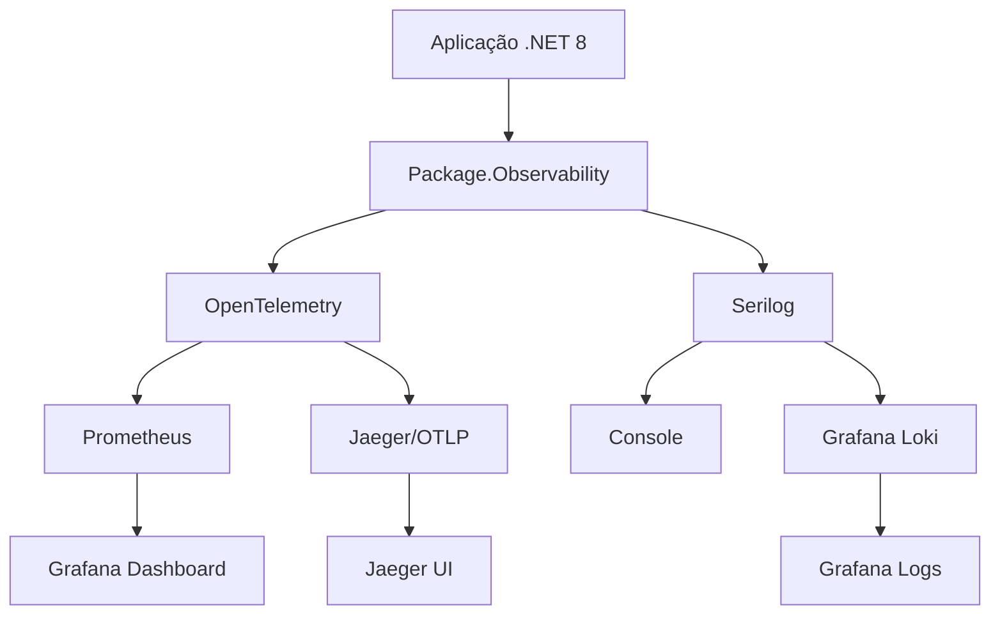

# Package.Observability - Documentação

Bem-vindo à documentação completa do **Package.Observability**, um pacote abrangente de observabilidade para aplicações .NET 8.

## 📚 Índice da Documentação

- [🚀 Guia de Início Rápido](getting-started.md)
- [⚙️ Configuração Detalhada](configuration.md)
- [📊 Métricas](metrics.md)
- [📝 Logs](logging.md)
- [🔍 Tracing](tracing.md)
- [🎯 Exemplos de Uso](examples.md)
- [🐳 Infraestrutura](infrastructure.md)
- [🧪 Testes](testing.md)
- [❓ FAQ](faq.md)
- [🔧 Troubleshooting](troubleshooting.md)

## 🎯 Visão Geral

O **Package.Observability** fornece uma solução completa de observabilidade para aplicações .NET 8, integrando:

- **Métricas**: Coleta e exportação automática para Prometheus
- **Logs Estruturados**: Configuração automática do Serilog com suporte a Loki
- **Tracing Distribuído**: Instrumentação OpenTelemetry com exportação OTLP

### ✨ Principais Características

- **🔧 Configuração Simples**: Uma linha de código para configurar tudo
- **📊 Métricas Automáticas**: Runtime, ASP.NET Core, HTTP Client
- **📝 Logs Estruturados**: Console e Loki com correlation ID
- **🔍 Tracing Automático**: Instrumentação completa com OpenTelemetry
- **🎛️ Altamente Configurável**: Via `appsettings.json` ou código
- **🚀 Fácil Extensão**: APIs para métricas e traces customizados

### 🏗️ Arquitetura



## 📦 Instalação

```bash
dotnet add package Package.Observability
```

## 🚀 Uso Básico

### 1. Configuração Mínima

```csharp
using Package.Observability;

var builder = WebApplication.CreateBuilder(args);

// Adiciona observabilidade completa
builder.Services.AddObservability(builder.Configuration);

var app = builder.Build();
app.Run();
```

### 2. Configuração no appsettings.json

```json
{
  "Observability": {
    "ServiceName": "MeuServico",
    "EnableMetrics": true,
    "EnableTracing": true,
    "EnableLogging": true
  }
}
```

## 📊 Resultados Imediatos

Após a configuração, você terá automaticamente:

- **Métricas Prometheus**: `http://localhost:9090/metrics`
- **Logs estruturados** no console e Loki
- **Traces distribuídos** enviados via OTLP
- **Correlation IDs** automáticos
- **Instrumentação** de HTTP requests, runtime .NET, etc.

## 🔗 Links Úteis

- [Repositório GitHub](https://github.com/your-org/Package.Observability)
- [Pacote NuGet](https://www.nuget.org/packages/Package.Observability)
- [Issues e Suporte](https://github.com/your-org/Package.Observability/issues)

## 📄 Licença

Este projeto está licenciado sob a [Licença MIT](../LICENSE).